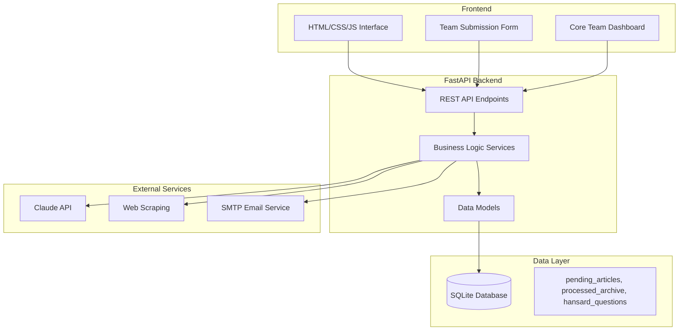

# Design Document

## Overview

The Media Monitoring Agent is a web-based application built with FastAPI backend and vanilla HTML/CSS/JavaScript frontend. The system follows a simple client-server architecture with SQLite for data persistence, external API integrations for content processing, and email capabilities for report distribution.

## Architecture



## Components and Interfaces

### Frontend Components

#### 1. Team Submission Form
- **Purpose**: Allow team members to submit article URLs
- **Elements**: Name input, URL input, submit button, status messages
- **Behavior**: Form validation, AJAX submission, success/error feedback

#### 2. Core Team Dashboard
- **Purpose**: Display pending articles and provide processing controls
- **Elements**: 
  - Pending articles table with columns: URL, Submitted By, Timestamp
  - Large textarea for paywalled content
  - "Generate Media Report" button
  - "Generate Hansard Report" button
  - Status indicators and progress feedback

### Backend API Endpoints

#### 1. Article Submission API
```python
POST /api/articles/submit
{
    "url": "string",
    "submitted_by": "string"
}
Response: {"success": boolean, "message": "string"}
```

#### 2. Pending Articles API
```python
GET /api/articles/pending
Response: [{"id": int, "url": "string", "submitted_by": "string", "timestamp": "datetime"}]
```

#### 3. Media Report Generation API
```python
POST /api/reports/media
{
    "pasted_content": "string"
}
Response: {"success": boolean, "message": "string", "report_id": "string"}
```

#### 4. Hansard Report Generation API
```python
POST /api/reports/hansard
Response: {"success": boolean, "message": "string", "report_id": "string"}
```

### Service Layer

#### 1. Article Service
- **Responsibilities**: URL validation, deduplication, database operations
- **Methods**:
  - `submit_article(url, submitted_by)`: Validate and store new articles
  - `get_pending_articles()`: Retrieve all pending articles
  - `move_to_archive(article_ids)`: Move processed articles to archive

#### 2. Scraping Service
- **Responsibilities**: Web content extraction from non-paywalled sources
- **Methods**:
  - `scrape_article(url)`: Extract text content from URL
  - `batch_scrape(urls)`: Process multiple URLs with error handling
- **Libraries**: BeautifulSoup4, requests, newspaper3k for robust content extraction

#### 3. AI Service
- **Responsibilities**: Claude API integration for content summarization
- **Methods**:
  - `summarize_content(text)`: Send content to Claude for summarization
  - `batch_summarize(texts)`: Process multiple texts efficiently
- **Configuration**: API key management, rate limiting, error handling

#### 4. Email Service
- **Responsibilities**: Report distribution via email
- **Methods**:
  - `send_report(html_content, recipients)`: Send HTML email with report
  - `format_html_report(summaries)`: Convert summaries to HTML format
- **Configuration**: SMTP settings, recipient lists, email templates

#### 5. Report Service
- **Responsibilities**: Orchestrate report generation workflow
- **Methods**:
  - `generate_media_report(pasted_content)`: Complete media report workflow
  - `generate_hansard_report()`: Complete Hansard report workflow

## Data Models

### Database Schema

#### pending_articles Table
```sql
CREATE TABLE pending_articles (
    id INTEGER PRIMARY KEY AUTOINCREMENT,
    url TEXT UNIQUE NOT NULL,
    pasted_text TEXT,
    timestamp DATETIME DEFAULT CURRENT_TIMESTAMP,
    submitted_by TEXT NOT NULL
);
```

#### processed_archive Table
```sql
CREATE TABLE processed_archive (
    id INTEGER PRIMARY KEY AUTOINCREMENT,
    url TEXT NOT NULL,
    timestamp DATETIME DEFAULT CURRENT_TIMESTAMP,
    submitted_by TEXT NOT NULL,
    processed_date DATETIME DEFAULT CURRENT_TIMESTAMP
);
```

#### hansard_questions Table
```sql
CREATE TABLE hansard_questions (
    id INTEGER PRIMARY KEY AUTOINCREMENT,
    question_text TEXT NOT NULL,
    category TEXT,
    timestamp DATETIME DEFAULT CURRENT_TIMESTAMP,
    source_articles TEXT -- JSON array of related article IDs
);
```

### Python Data Models

#### Article Model
```python
from pydantic import BaseModel
from datetime import datetime
from typing import Optional

class Article(BaseModel):
    id: Optional[int] = None
    url: str
    pasted_text: Optional[str] = None
    timestamp: datetime
    submitted_by: str

class ArticleSubmission(BaseModel):
    url: str
    submitted_by: str
```

#### Report Models
```python
class MediaReportRequest(BaseModel):
    pasted_content: str

class ReportResponse(BaseModel):
    success: bool
    message: str
    report_id: Optional[str] = None
```

## Error Handling

### Frontend Error Handling
- Form validation with client-side feedback
- AJAX error handling with user-friendly messages
- Loading states during API calls
- Graceful degradation for JavaScript failures

### Backend Error Handling
- HTTP status codes for different error types
- Structured error responses with meaningful messages
- Logging for debugging and monitoring
- Graceful handling of external service failures

### External Service Error Handling
- **Web Scraping**: Timeout handling, invalid URL detection, content extraction failures
- **Claude API**: Rate limiting, authentication errors, service unavailability
- **Email Service**: SMTP connection failures, invalid recipients, attachment size limits

## Testing Strategy

### Unit Testing
- **Models**: Data validation, serialization/deserialization
- **Services**: Business logic, error handling, external service mocking
- **API Endpoints**: Request/response validation, authentication, error cases

### Integration Testing
- **Database Operations**: CRUD operations, constraint validation, transaction handling
- **External Services**: API integration with mock services
- **End-to-End Workflows**: Complete report generation process

### Frontend Testing
- **Form Validation**: Client-side validation rules
- **API Integration**: AJAX calls, error handling, UI updates
- **Cross-browser Compatibility**: Basic functionality across modern browsers

### Test Data Management
- **Fixtures**: Sample articles, test users, mock API responses
- **Database Seeding**: Consistent test data setup
- **Cleanup**: Proper test isolation and cleanup procedures

## Security Considerations

### Input Validation
- URL validation and sanitization
- SQL injection prevention through parameterized queries
- XSS prevention in frontend display

### API Security
- Rate limiting on submission endpoints
- Input size limits for pasted content
- CORS configuration for frontend access

### External Service Security
- Secure API key storage and rotation
- HTTPS enforcement for external API calls
- Email security with proper authentication

## Configuration Management

### Environment Variables
```python
# Database
DATABASE_URL = "sqlite:///media_monitoring.db"

# Claude API
CLAUDE_API_KEY = "your-claude-api-key"
CLAUDE_API_URL = "https://api.anthropic.com/v1/messages"

# Email Configuration
SMTP_HOST = "smtp.gmail.com"
SMTP_PORT = 587
SMTP_USERNAME = "your-email@gmail.com"
SMTP_PASSWORD = "your-app-password"
EMAIL_RECIPIENTS = ["recipient1@example.com", "recipient2@example.com"]

# Application
DEBUG = False
LOG_LEVEL = "INFO"
```

### Deployment Configuration
- Environment-specific settings
- Database initialization scripts
- Static file serving configuration
- Process management for background tasks